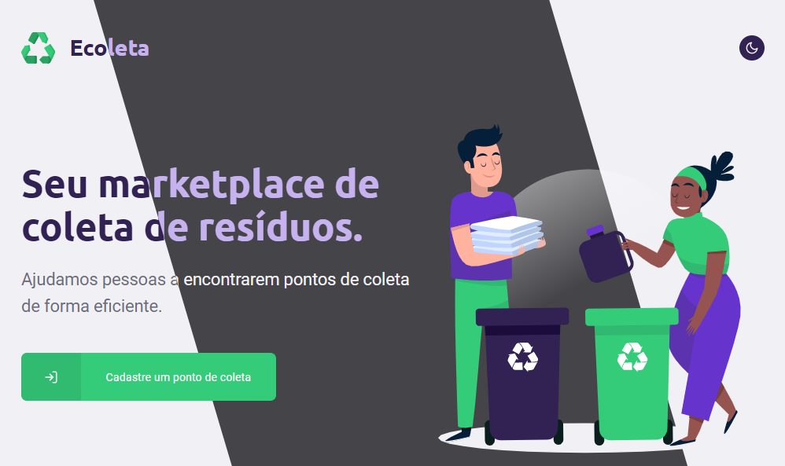

<h1 align="center">
  
   
  Ecoleta
</h1>

  Uma API REST, aplicação web e <em>mobile</em> para facilitar o descarte correto de lixo reciclável. 🌳

  <em>
    Construído durante a <u>Next Level Week #1</u> da <a href="https://rocketseat.com.br/">Rocketseat</a>. 🚀
  </em>

  
  
  
  
  

 

  

## :book: Propósito
Diferentemente do projeto original (que já é muito bom para um semana :smile:), este repositório é um ambiente de experimentação que inclui recursos aprimorados e ferramentas, como:

- Manutenção de pacotes com [Lerna](https://lerna.js.org).
- Gerenciamento de dependências com [Yarn workspaces](https://classic.yarnpkg.com/en/docs/workspaces).
- _Linters_: [stylelint](https://stylelint.io), [eslint](https://eslint.org), [prettier](https://prettier.io), [lintstaged](https://github.com/okonet/lint-staged).
- Git _hooks_ com [husky](https://github.com/typicode/husky).
- Integração com banco de dados usando [TypeORM](https://typeorm.io).
- Testes usando [Jest](https://jestjs.io), incluindo [cobertura de testes](https://codecov.io/gh/leandroslc/ecoleta).
- Integração Contínua com [GitHub Actions](https://github.com/leandroslc/ecoleta/actions).
- Estilização de componentes React usando [emotion](https://emotion.sh/) e temas usando [theme-ui](https://theme-ui.com/).

## :sparkles: Recursos adicionais
- `(api)` URLs indenpendentes de ambiente para as imagens enviadas.
- `(web)` Temas Escuro/Claro e components.
- `(web)` Página para rota não encontrada (404).
- `(web)` Mensagem de sucesso.
- `(web)` Validação de formulário (client side).
- `(mobile)` Dropdowns para selecionar estados and cidades.
- `(mobile)` Automaticamente detecta o endereço de IP local para desenvolvimento.

## :rocket: Início Rápido
- Instale o [Node](https://nodejs.org) e o [Yarn](https://classic.yarnpkg.com).

> Na raiz do repositório:
- Execute os comandos `yarn` e `yarn bootstrap`.
- Prepare o banco de dados de desenvolvimento com o comando `yarn migrate`.
- E execute o comando `yarn start:{projeto}` para iniciar uma das aplicações listadas abaixo.

## :briefcase: Projetos

Nome                               | Descrição         | Dependência
:--------------------------------- | :---------------- | :-----------
&#9745; [api](/packages/api)       | API               | --
&#9745; [web](/packages/web)       | Aplicação Web     | `api`
&#9745; [mobile](/packages/mobile) | Aplicação Mobile  | `api`
